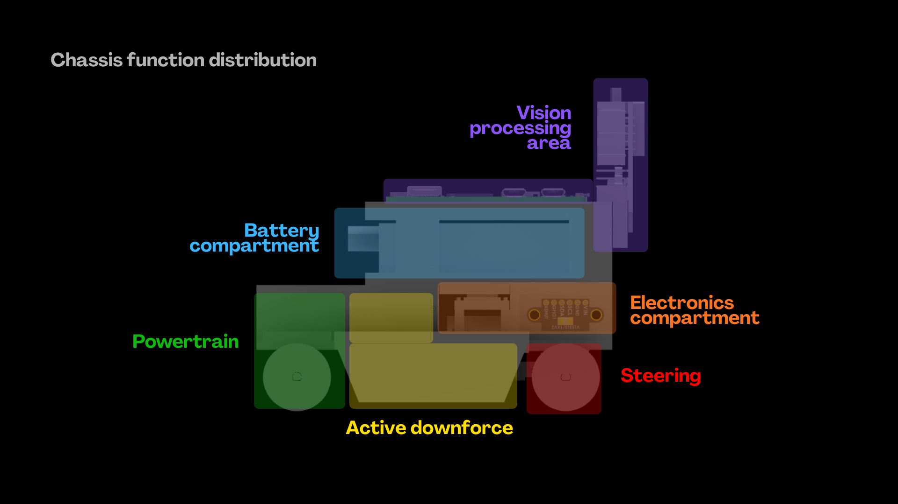
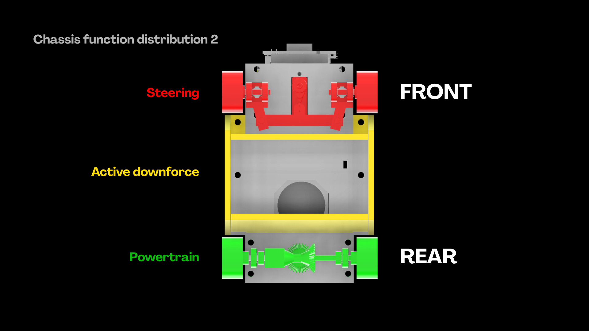
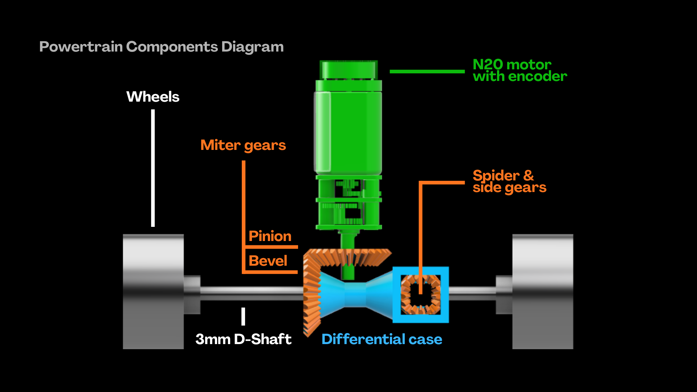
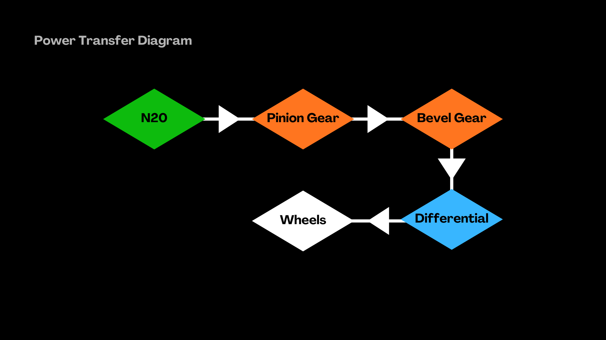
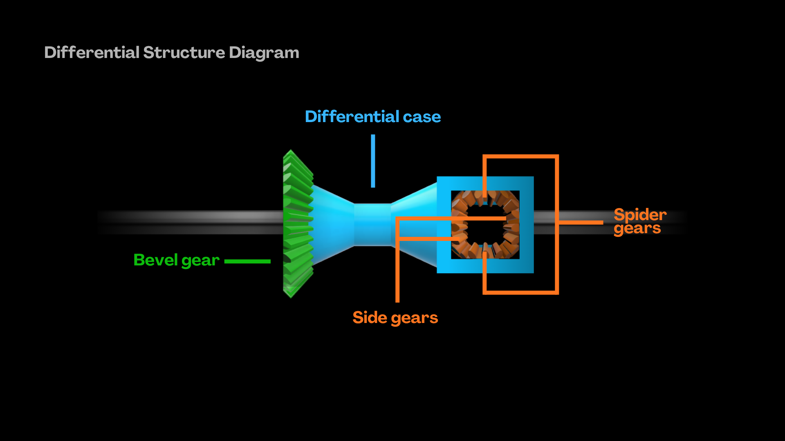

# WRO 2026 Future Engineers — Team APEX

## Table of Contents

1. [Overview](https://github.com/wro26-teamapex/WRO2026_FE_Apex#1-overview)    
&emsp;1.1 [About APEX](https://github.com/wro26-teamapex/WRO2026_FE_Apex#about-apex)  
&emsp;1.2 [Specialties](https://github.com/wro26-teamapex/WRO2026_FE_Apex#specialties)  
&emsp;1.2 [Robot Images](https://github.com/wro26-teamapex/WRO2026_FE_Apex#robot-images)  
&emsp;1.3 [Performance Videos](https://github.com/wro26-teamapex/WRO2026_FE_Apex#performance-videos)  

3. Mobility and Mechanical Design  
&emsp;2.1 Chassis Design  
&emsp;2.2 Powertrain  
&emsp;2.3 Steering Mechanism  
&emsp;2.4 Stability Improvements  

4. Power and Sensor Architecture  
&emsp;3.1 Power Source  
&emsp;3.2 Camera and Sensors  
&emsp;3.3 Dual Core System  
&emsp;3.4 Circuit Diagram  
&emsp;3.5 Power Consumption Modeling  

5. Software Architecture  
&emsp;4.1 Open Challenge  
&emsp;4.2 Obstacle Challenge  
&emsp;4.3 Parallel Parking  
&emsp;4.4 Code Structure   
&emsp;4.5 Instructions  

6. MathWorks® Modeling - SPARK Model  

7. Engineering Process - PRIMES Framework  

8. Building Instructions for Reproducibility  

9. Resources  
&emsp;8.1 3D CAD Models  
&emsp;8.2 List of Components  
&emsp;8.3 Suggestions for Further Development   

---
>[!NOTE]
>**This repo contains generalized buttons, which provide extra details regarding the design of APEX.**  
>
>  
>🞙 Discussion on pros & cons of the design, comparison with other applicable methods  
>
>  
>🞙 Detailed calculations regarding the topic  
>
>  
>🞙 Components checklist for the specific section  

---

## The Team
We are a team of three enthusiastic students from **St. Paul’s College, Hong Kong**, participating in the World Robot Olympiad (WRO) Future Engineers category. United by our passion for robotics, innovation, and problem-solving, we strive to learn, collaborate, and break our limits in this international competition. We are proud to represent our school and look forward to competing and connecting with fellow robotics enthusiasts from around the world.

### Contributions
| Tin Shing Kwan, Amos | Tsang Kwok Cho, Hugo | Tsang Suen Hoi, Jasper |
| :---: | :---: | :---: |
| Mechanical Design, Circuit Design, 3D Modelling, Sensor Integration | Software Engineering, MathWorks® Modeling, Mechanical Improvement, Documentation | Wiring, Iteration and Testing, Logistics, Documentation |

---
## 1. Overview
>### About APEX
>APEX is an ultra-compact autonomous vehicle engineered for exceptional speed, agility, and precision for the Future Engineers category.
>
>The vehicle incorporates a full Ackermann steering mechanism, a rear mechanical differential, and an active downforce system to optimise cornering performance and stability at high speeds. Inspired by the innovative Formula 1 car Brabham BT46B, APEX is designed to achieve remarkable cornering velocities, reflected in its name.
>
>A dual-core architecture combining an ESP32 and Raspberry Pi Zero 2W enables efficient task distribution: Python-based vision processing with the Pixy2 camera runs seamlessly alongside fast C++ control algorithms on the ESP32. Powered by a high-discharge 2S LiPo battery, APEX intelligently fuses data from dual Time-of-Flight (ToF) sensors and an IMU to deliver precise navigation, reliable obstacle handling, and automated parallel parking.

### Specialties

🞙 **Downforce Generation System**  
The active downforce generation system utilizes a fan to create a vacuum at the belly of the car, creating constant downforce which improves grip and minimises skidding, allowing the car to
move at much higher speeds during turns.  
[In-depth explanation in Section 2.5](https://github.com/wro26-teamapex/WRO2026_FE_Apex/edit/main/README.md#25-stability-improvement)

🞙 **Hybrid Fitting Design**  
APEX adopts snap-to-fit designs for most chassis plastic components, while using hex and nut bearings to fixate motors. The snap to fit design allows layers of the chassis to be replaced
swiftly, hence faster repairs and prototyping. On the contrary, hex and nut provide great stability for dynamic components such as motors.  
[In-depth explanation in Section 2.4](https://github.com/wro26-teamapex/WRO2026_FE_Apex/edit/main/README.md#24-chassis-design-distribution-aerodynamics)

🞙 **Heterogeneous Architecture**  
Our dual MCU design splits workloads cleanly to minimise delays. The Raspberry Pi Zero 2W processes vision and navigation, while the Arduino Nano ESP32 manages sensor and motor control.  
[In-depth explanation in Section 3.3](https://github.com/wro26-teamapex/WRO2026_FE_Apex/edit/main/README.md#24-chassis-design-distribution-aerodynamics)

### Robot Images

<table>
  <tr>
    <td></td>
    <td></td>
    <td></td>
  </tr>
  <tr>
    <td align="center">Front</td><td align="center">Back</td><td align="center">Left</td>
  </tr>
  <tr>
    <td></td>
    <td></td>
    <td></td>
  </tr>
  <tr>
    <td align="center">Right</td><td align="center">Top</td><td align="center">Bottom</td>
  </tr>
</table>

### Performance Videos

---
## 2. Mobility and Mechanical Design

### 2.1 Chassis Design

General Specifications

---

**Dimensions:** 115mm (L) x 80mm (W) x 105mm (H)  

**Total Mass:** Xg  

**3D printing material:** PETG, Nylon  

**Drive configuration:** Front wheel steering, rear wheel drive  

---

Vehicle Structure

---

APEX is divided into six vital parts, each part having its respective function.  

<table align="center" border="0">
  <tr>
    <td align="center"></td>
    <td align="center"></td>
  </tr>
  <tr>
    <td align="center"><b>Fig 2.1.1 </b>Chassis Function Distribution (Side) </td>
    <td align="center"><b>Fig 2.1.2 </b>Chassis Function Distribution (Bottom) </td>
  </tr>
</table>

🞙 $\color{#ff5252}\mathbf{\mathsf{STEERING}}$ - Redirects the vehicle’s trajectory  
🞙 $\color{#ff9452}\mathbf{\mathsf{ELECTRONICS\ COMPARTMENT}}$ - Houses most of the car’s sensors and electronics  
🞙 $\color{#ffd452}\mathbf{\mathsf{ACTIVE\ DOWNFORCE}}$ - Creates a vacuum at the vehicle's belly  
🞙 $\color{#64d941}\mathbf{\mathsf{POWERTRAIN}}$ - Propels the car forward  
🞙 $\color{#4d95e8}\mathbf{\mathsf{BATTERY\ COMPARTMENT}}$ - Sole electricity supplier for all car components  
🞙 $\color{#9d4de8}\mathbf{\mathsf{VISION\ PROCESSING\ AREA}}$ - Captures and analyses vision  

---

Hybrid Fitting Design

---

A hybrid fastening strategy for the vehicle components was engineered, combining simple snap-to-fit joints and screw-and-nut assemblies to secure structural components.  

<table align="center" border="0">
  <tr>
    <td align="center"></td>
    <td align="center"></td>
  </tr>
  <tr>
    <td align="center"><b>Fig 2.1.3 </b>Snap-to-fit joint example</td>
    <td align="center"><b>Fig 2.1.4 </b>Screw-and-nut assembly example</td>
  </tr>
</table>

Static components (e.g. most of the chassis components) are fixated via snap-to-fit joints.  
They include a 0.1mm buffer gap on every side to allow minimal 3D printing errors.   
Dynamic components (e.g. servo motor & N20 motor) are fixated via screw-and-nut assemblies.  

---

### 2.2 Powertrain  

Rear propulsion

---

Rear propulsion of APEX is driven by an N20 gear motor [] equipped with an integrated encoder for precise feedback. Rotational torque is transferred 90° via a perpendicular pair of custom nylon-printed miter gears []. The bevel gear is coupled to the differential case, which distributes mechanical power to both d-shafts [] while allowing independent wheel rotation, eliminating skidding during cornering.

<table align="left" border="0">
  <tr>
    <td align="left"></td>
  </tr>
  <tr>
    <td align="left"><b>Fig 2.2.1 </b>Powertrain Components Diagram</td>
  </tr>
</table>  
 

How is rotational power transferred?  

1. N20 motor rotates the pinion gear  
2. The pinion gear rotates the bevel gear, angle shifted 90° clockwise  
3. The attached differential case rotates along the d-shaft  
4. The differential’s planet and sun gears distribute torque to both shafts  
5. The shafts rotate the wheel  

<table align="left" border="0">
  <tr>
    <td align="left"></td>
  </tr>
  <tr>
    <td align="left"><b>Fig 2.2.2 </b>Power Transfer Diagram</td>
  </tr>
</table>  
 

---

The differential

---

Composed of 1x bevel gear [], 1x differential case [], 2x spider gears [] and 2x side gears [], it is one of the two measures (the other being full Ackermann steering, mentioned in Section 2.3) we opted to eliminate tire scrubbing, which improves movement accuracy.

<table align="left" border="0">
  <tr>
    <td align="left"></td>
  </tr>
  <tr>
    <td align="left"><b>Fig 2.2.3 </b>Differential Structure Diagram</td>
  </tr>
</table>  
 

---

  

### 2.3 Steering Mechanism  

### 2.4 Stability Improvements

---

## Power and Sensor Architecture  

### 3.1 Power Source  

### 3.2 Camera and Sensors  

### 3.3 Dual Core System  

### 3.4 Circuit Diagram  

### 3.5 Power Consumption Modeling  

Powered by a nominal **2S LiPo (7.4 V)** source, the model tracks steady-state and transient power allocations across downstream **12V thermal** and **5V logic** subsystems. By mapping conversion inefficiencies and component-level duty cycles, the model evaluates hardware safety margins, verifies over-current protection boundaries, and links battery state-of-charge (SoC) degradation directly to dynamic on-track performance degradation.

Explicit Modeling Assumptions & Simplifications

---

To maintain a bounded, deterministic state space for calculations, the model operates under the following explicitly declared structural simplifications:

- **Ideal Single-Node Common Ground**: The complete system ground network (GND) is treated as a zero-resistance, ideal reference node; ground-loop impedances, trace parasitics, and return-path switching noise are omitted.
- **Flat Nominal Rail Bus**: Primary electrical budget segments hold the source battery potential static at a nominal **2S LiPo voltage (7.4 V)**. Voltage sag originating from internal cell resistance ($R_{\text{int}}$) and non-linear discharge capacity variations are decoupled into a discrete state-of-charge evaluation (Section 3.5.4).
- **Cascaded Rail Folding**: The **3.3 V** downstream logic rail (powering the VL53L1X ToF arrays and the MPU6050 IMU) is structurally folded into the Arduino Nano ESP32 $\text{V}_{\text{IN}}$ pin current budget at the **5V** level to prevent downstream algebraic double-counting on the upstream buck converter.

---

Mathematical Formulation & Multi-Rail Budgeting

---

The vehicle topology is constructed as an explicit data structure containing discrete current states ($\vec{I}_k$), corresponding localized time duty fractions ($\vec{D}_k$), and absolute transient peak currents ($I_{\text{peak}, k}$).

The duty-weighted average current for any arbitrary load element $k$ is governed by:

$$I_{\text{avg}, k} = \sum_{m=1}^{M} I_{k, m} \cdot D_{k, m} \quad \text{where} \quad \sum_{m=1}^{M} D_{k, m} = 1.0$$  

The input power ($P_{\text{in}}$) and supply current ($I_{\text{in}}$) drawn from the primary **7.4 V** bus through an arbitrary switching regulator operating at an efficiency coefficient $\eta$ are computed via power-balance transformations:

$$P_{\text{in}} = \frac{P_{\text{out}}}{\eta} = \frac{V_{\text{out}} \cdot \sum I_{\text{avg, loads}}}{\eta} \quad \text{and} \quad I_{\text{in}} = \frac{P_{\text{in}}}{V_{\text{in}}}$$

---

Electrical Subsystem Parameters

---

The underlying parameters are categorized into specific hardware domains sourced directly from component datasheets, bench measurements, or conservative engineering bounds.

**Primary Source (Battery)**

| Parameter Metric              | Value                          | Characterization Type |
|-------------------------------|--------------------------------|-----------------------|
| Battery Chemistry / Config    | 2S LiPo (7.4 V Nominal)       | DATASHEET            |
| Pack Nameplate Capacity       | 300 mAh (0.3 Ah)               | CONFIRM              |
| Max Continuous Discharge      | 20C (6.0 A Safe Limit)        | CONFIRM              |

**Drivetrain Actuation**

| Parameter Metric              | Value                              | Characterization Type |
|-------------------------------|------------------------------------|-----------------------|
| N20 Motor Run Current         | 0.35 A                             | ESTIMATE             |
| N20 Motor Stall Current       | 1.50 A                             | CONFIRM              |
| TB6612FNG Driver Limit        | 1.2 A Continuous / 3.2 A Peak     | DATASHEET            |

**12V Thermal Rail**

| Parameter Metric              | Value                                      | Characterization Type |
|-------------------------------|--------------------------------------------|-----------------------|
| KOOBOOK Boost Regulator       | $\eta = 85\%$, $I_{\text{max, out}} = 1.0\text{ A}$ | ESTIMATE / CONFIRM   |
| Delta BFB0312HA-C Fan         | 12V Nominal, 0.84 W (0.07 A Rated)        | DATASHEET            |

**5V Logic & Control**

| Parameter Metric                  | Value                                                      | Characterization Type |
|-----------------------------------|------------------------------------------------------------|-----------------------|
| Synchronous Buck Regulator        | $\eta = 92\%$, $I_{\text{rated}} = 3.0\text{ A}$          | ESTIMATE / CONFIRM   |
| Raspberry Pi Zero 2W              | 0.15 A Idle / 0.35 A Typ / 0.70 A Peak                    | ESTIMATE             |
| High-Torque Steering Servo        | 0.01 A Idle / 0.10 A Typ / 0.80 A Stall                   | ESTIMATE / CONFIRM   |
| Arduino Nano ESP32                | 0.08 A Typ / 0.18 A Peak (Measured at $\text{V}_{\text{IN}}$) | ESTIMATE             |

---

Safety Margins & System Pass/Fail Verification

---

To ensure hardware survivability during transient faults or mechanical lockups, the system computes structural operating margins against defined alert thresholds:

**SYSTEM SAFETY MARGIN VERIFICATION**

- **[PASS]** Power Balance Verification: Total Battery Power == Useful Power + Conversion Losses (Within 0.01 W)
- **[OK]** TB6612FNG Continuous Margin: **3.43x** (Threshold: ≥ 1.5x)
- **[OK]** TB6612FNG Stall Margin: **2.13x** (Threshold: ≥ 1.0x)
- **[OK]** Buck Converter Peak Margin: **1.79x** (Threshold: ≥ 1.3x)
- **[OK]** Boost Converter Margin: **14.29x** (Threshold: ≥ 1.3x)
- **[OK]** Battery C-rating Margin: **8.79x** (Threshold: ≥ 2.0x)

> **WARNING**
>
> The script embeds native runtime exceptions to prevent component destruction. If a physical jam occurs, the N20 stall current (1.50 A) remains safely below the driver's 3.2 A pulse threshold. However, if any system modifications decrease the battery C-rating margin below **2.0x** or reduce the cumulative competition-day charge margin below **1.0x**, a compiler warning is thrown to enforce a mid-day battery swap or a safe firmware-level sleep implementation.

---

State-of-Charge & Dynamic Voltage Sag Extension

---

The model introduces a sag-aware coupling framework. Regulated-rail components behave as constant power sinks ($P$), forcing battery draw ($I_{\text{load}}$) to escalate as cell open-circuit voltage (OCV) decays.

The terminal voltage under load ($V_{\text{term}}$) is solved deterministically at each **5% SoC** step by taking the principal physical root of the quadratic expression:

$$V_{\text{term}}^2 - \text{OCV}(\text{SoC}) \cdot V_{\text{term}} + P \cdot R_{\text{int}} = 0 \implies V_{\text{term}} = \frac{\text{OCV}(\text{SoC}) + \sqrt{\text{OCV}(\text{SoC})^2 - 4 \cdot P \cdot R_{\text{int}}}}{2}$$

As the pack drains from **100%** charge down to its **80%** usable capacity floor (20% remaining SoC), the terminal voltage falls from **8.16 V** to **7.16 V**. This reduction directly drops the motor’s no-load RPM, imposing a **+4.8% lap-time slowdown penalty** (15.00 s nominal scaling to 15.72 s per lap).

---

3.5.6 Automated Data Visualization Outputs

---

Execution of the model automatically generates and archives four high-resolution assets into the project repository:

- **`fig1_power_distribution.png`**: Stacked horizontal power bar chart illustrating allocation of raw battery wattage across mechanical output, logic rails, and converter thermodynamic losses.
- **`fig2_sensitivity_heatmap.png`**: 3×3 sensitivity matrix mapping variations in boost and buck efficiencies ($\eta$) against aggregate battery current draw.
- **`fig3_runtime_comparison.png`**: Categorical bar visualization tracking nominal runtime (**26.3 min**), safe usable runtime down to the 80% DoD floor (**21.0 min**), and strict cumulative competition-day driving requirements (**3.0 min**).
- **`fig4_per_lap_depletion.png`**: Continuous linear decay plot tracing state-of-charge depletion against consecutive laps. A standard **300 mAh** pack safely guarantees **84.1 laps** (**28.0 full runs**) before breaching the voltage safety floor.

---

## Software Architecture  

### 4.1 Open Challenge  

### 4.2 Obstacle Challenge  

### 4.3 Parallel Parking  

### 4.4 Code Structure   

### 4.5 Instructions  

---

## MathWorks® Modeling - SPARK Model  

---

## Engineering Process - PRIMES Framework  

The PRIMES Framework is our overarching, model-based systems engineering workflow for the entire WRO project. It defines how we approach the full development lifecycle — from initial concept and mechanical design through to control implementation, testing, optimization, and final validation.

At its core, PRIMES enforces a disciplined, iterative process that deeply integrates MATLAB, Simulink, and Simscape throughout every stage of engineering. Simulation is not an afterthought or simple graphing tool; it is a primary driver of design decisions, risk reduction, and performance improvement.

**Core Philosophy**
Model → Simulate → Validate against real hardware → Iterate.
What PRIMES Stands For
- Prototype
Create high-fidelity digital prototypes (plant models, controllers, sensor systems, and powertrain) using MATLAB/Simulink/Simscape before committing to physical hardware.
- Refine
Use simulation to rapidly explore design alternatives, optimize parameters, and test scenarios that would be difficult or time-consuming to evaluate physically.
- Integrate
Seamlessly bridge virtual models with real-world components through Hardware-in-the-Loop (HIL) testing, Embedded Coder code generation, and real-time interfaces.
- Measure
Collect detailed performance data from the physical vehicle and test setups, then quantitatively compare it against simulation results to validate model accuracy.
- Evaluate
Analyze results, identify gaps between simulation and reality, assess key metrics (lap time, stability, energy efficiency, sensor reliability, etc.), and determine root causes of discrepancies.
- Systematize (Iterate)
Formalize lessons learned, update models/mechanical designs/controllers, and systematically iterate through the cycle until targets are achieved.

**Application Across the Project**
We applied the PRIMES framework holistically across all aspects of development:
- Mechanical design and vehicle dynamics
- Electrical and powertrain systems
- Control algorithms (PID speed & steering)
- Computer vision and sensor processing (Pixy2)
- Energy efficiency analysis
- Lap time optimization and parametric studies
- Overall system integration and track testing

This structured approach enabled strong correlation between virtual predictions and actual performance, minimized physical prototyping iterations, and allowed data-driven decisions throughout the project.

--- 

## Building Instructions for Reproducibility  

---

## Resources  

### 8.1 3D CAD Models  

### 8.2 List of Components  

### 8.3 Suggestions for Further Development  

---

## Acknowledgement

We would like to express our sincere gratitude to everyone who supported us throughout this challenging yet rewarding journey. 

We are especially thankful to **Mr. H. T. Tsui** for providing patient guidance, tireless support during countless debugging sessions, and constantly inspiring us to push beyond our limits. 

We extend our deep appreciation to **St. Paul's College** for generously providing dedicated workspace, access to essential equipment, and logistical travel support that enabled us to participate in the competition. 

Our heartfelt thanks go to the **WRO Association** for organising this remarkable international competition that continues to drive innovation and engineering excellence among students worldwide. 

Finally, we acknowledge the invaluable contributions of the **open-source community**, including the developers of OpenCV, Python, the Raspberry Pi Foundation, PixyCam, and all other libraries and tools whose collective efforts have powerfully supported the realisation of our autonomous vehicle.

---

## License

Released under the **MIT License** — see [`LICENSE`](./LICENSE). Learn from and build on APEX freely. A mention back to **Team APEX** is always appreciated. 

---

**Built with curiosity, simulation, and a lot of testing by Team APEX**

*WRO Future Engineers · Season 2026 · Hong Kong*

